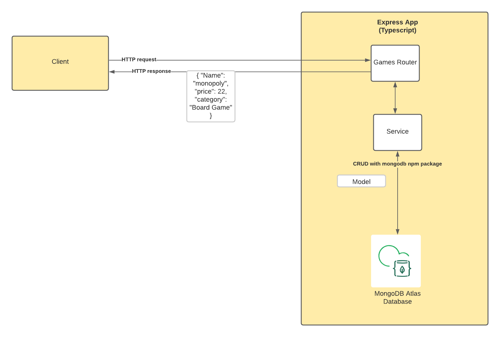

## Introduction

Welcome to this MongoDB and TypeScript sample project.
The aim of this project is to give you a working example of how you can use the power of MongoDB Atlas with TypeScript and Express to create modern web applications.

## Running the project

In order to run this project:

1. Create a `.env` file in the root of the project with the same properties as `env.example`
2. Update the values with your connection string, database name and collection name
3. Run `npm i` to install all dependencies listed in `package.json`
3. Run `npm start`

## Branches

This repository has two branches `main` and `finish`.

- `main` contains the boilerplate code to get you started, following the instructions in the companion blog post - [How to Use TypeScript with MongoDB Atlas](https://www.mongodb.com/compatibility/using-typescript-with-mongodb-tutorial).
- `finish` contains a working example complete with CRUD operations and schema validation. This is how `main` will look after following the tutorial. This also gives a working example for anyone looking for a final copy and not intending to follow the post.

## Getting to know the code

The below diagram shows the overall architecture of the diagram and the following sections will explain the code.



### Users Router

The users.router.ts class uses Express's Router functionality. It defines the endpoints available to clients for the Create, Read, Update and Delete (CRUD) operations and then communicates with the database via the MongoDB NodeJS Driver.

### Database Service

The database.service.ts class implements the connection the database. This is also where schema validation is applied to the collection at database level.

### Models

TypeScript is an optionally statically typed language that allows for taking advantage of object-orientated programming. The users.ts class creates a class that defines the properties and data types expected in our document. We use this model throughout the code to enjoy the benefits of typed objects.

## More information

If you want more information about MongoDB and Atlas, the powerful cloud-based database solution, you can view [the documentation](https://docs.atlas.mongodb.com/).

## Disclaimer

Use at your own risk; not a supported MongoDB product.


# express-mongoose-ra-json-server

[](https://www.npmjs.com/package/express-mongoose-ra-json-server)

Create express.js routes from a mongoose model for ra-data-json-server. Very useful for rapid prototyping with MongoDB, Mongoose, and [react-admin](https://github.com/marmelab/react-admin).  
Example/demo project is available here: [express-mongoose-ra-json-server-demo](https://github.com/NathanAdhitya/express-mongoose-ra-json-server-demo)

## Installation

NPM: `npm add express-mongoose-ra-json-server`  
Yarn: `yarn add express-mongoose-ra-json-server`  
PNPM: `pnpm add express-mongoose-ra-json-server`

### Client Usage

```ts
import jsonServerProvider from "ra-data-json-server"; // Use ra-data-json-server
const apiUrl = "api/admin"; // Fill this in with your own URL or whatever you wish.
const dataProvider = jsonServerProvider(apiUrl, httpClient);
```

## Usage

Refer to the typescript definitions in [index.ts](src/index.ts) for a more complete information.

### Basic Usage

```ts
import raExpressMongoose from "express-mongoose-ra-json-server";
router.use("/user", raExpressMongoose(userModel));
```

### More Configuration Options

Pass in the options as a second parameter to the function.  
The currently exported typedefs contain just enough comments to describe what they do.

```ts
export interface raExpressMongooseOptions<T> {
  /** Fields to search from ?q (used for autofill and search) */
  q?: string[];

  /** Base name for ACLs (e.g. list operation does baseName.list) */
  aclName?: string;

  /** Fields to allow regex based search (non-exact search) */
  allowedRegexFields?: string[];

  /** Regex flags for regex-based search */
  regexFlags?: string;

  /** Read-only fields to filter out during create and update */
  readOnlyFields?: string[];

  /** Function to transform inputs received in create and update */
  inputTransformer?: (input: Partial<T>) => Promise<Partial<T>>;

  /** Additional queries for list, e.g. deleted/hidden flag. */
  listQuery?: Record<string, any>;

  /** Max rows from a get operation to prevent accidental server suicide (default 100) */
  maxRows?: number;

  /** Extra selects for mongoose queries (in the case that certain fields are hidden by default) */
  extraSelects?: string;

  /** Disable or enable certain parts. */
  capabilities?: raExpressMongooseCapabilities;

  /** Specify a custom express.js router */
  router?: Router;

  /** Should all queries use lean? (default = true) */
  useLean?: boolean;

  /** Specify an ACL middleware to check against permissions */
  ACLMiddleware?: (name: string) => RequestHandler;
}
```

## Query Operators

MongoDB Query Operators can be used by appending them as a suffix to the field name ([see here](https://marmelab.com/react-admin/FilteringTutorial.html#filter-operators)).

### Supported Operators

| MongoDB Query Operator | Field Suffix | Description                                                                                                                                                                   |
| ---------------------- | ------------ | ----------------------------------------------------------------------------------------------------------------------------------------------------------------------------- |
| $eq                    | \_eq         | Matches values that are equal to a specified value. <br/> (Useful for matching exact values if a field is included in allowedRegexFields) <br/> Example: `/user?name_eq=Alex` |
| $gt                    | \_gt         | Matches values that are greater than a specified value. <br/> Example: `/user?createdAt_gt=2022-10-25T00%3A00%3A00.000Z`                                                      |
| $gte                   | \_gte        | Matches values that are greater than or equal to a specified value. <br/> Example: `/user?createdAt_gte=2022-10-25T00%3A00%3A00.000Z`                                         |
| $in                    | \_in         | Matches any of the values specified in an array. <br/> Example: `/user?name_in=Alex&name_in=Peter`                                                                            |
| $lt                    | \_lt         | Matches values that are less than a specified value. <br/> Example: `/user?createdAt_lt=2022-10-25T00%3A00%3A00.000Z`                                                         |
| $lte                   | \_lte        | Matches values that are less than or equal to a specified value. <br/> Example: `/user?createdAt_lte=2022-10-25T00%3A00%3A00.000Z`                                            |
| $ne                    | \_ne         | Matches all values that are not equal to a specified value. <br/> Example: `/user?name_ne=Alex`                                                                               |
| $nin                   | \_nin        | Matches none of the values specified in an array. <br/> Example: `/user?name_nin=Alex&name_nin=Peter`                                                                         |